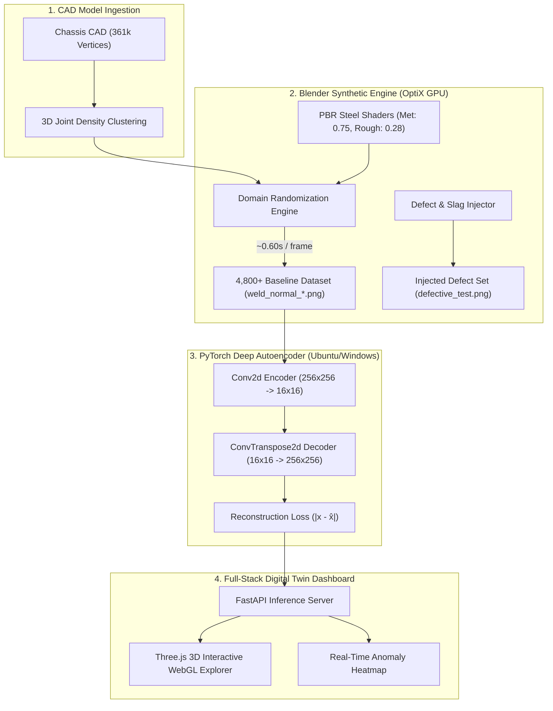

# 🚗 Automotive Chassis Digital Twin & Structural Anomaly Detection

[](https://www.python.org/)
[](https://pytorch.org/)
[](https://www.blender.org/)
[](https://fastapi.tiangolo.com/)
[](https://opensource.org/licenses/MIT)

An end-to-end **AI-Powered Digital Twin & Visual Inspection Platform** for vehicle structural ladder-frame chassis assemblies. The system combines high-throughput GPU synthetic data generation in Blender, physics-informed domain randomization, and deep convolutional autoencoders to detect microscopic manufacturing defects, weld flaws, and structural misalignments.

---

## 📌 Architecture Overview



---

## ⚡ Key Features

- **Blender Cycles OptiX Acceleration**:
  - Accelerated via NVIDIA RTX GPU with hardware AI neural denoising.
  - Generates photorealistic `1024x1024` frames in **~0.60s – 0.80s** (~80x speedup over CPU).
  - In-memory persistent datablocks avoiding `bpy.ops` operator garbage collection bottlenecks.
- **True Structural CAD Joint Mapping**:
  - Analyzes 361,174 CAD vertices via 3D spatial voxel clustering to target critical structural junctions (suspension brackets, crossmembers, hitch plates).
- **Physics-Informed Domain Randomization**:
  - Multi-axis sun angle variance (Azimuth $0^\circ-360^\circ$, Pitch $25^\circ-70^\circ$, Roll $\pm 20^\circ$).
  - Dynamic factory lighting intensity shifts (`3.0` to `8.5` energy).
  - Sub-millimeter sensor mounting vibration and focal jitter ($\pm 0.03$ X/Y, $\pm 0.05$ Z, $\pm 3.5^\circ$ roll).
- **Mathematical Defect & Slag Injection**:
  - Spawns irregular, distorted 3D oxidic slag/spatter geometry directly on weld seams for out-of-distribution anomaly testing.
- **Deep Convolutional Autoencoder (CAE)**:
  - 4-stage convolutional downsampling with batch normalization and LeakyReLU activations.
  - Generates pixel-accurate reconstruction difference heatmaps ($|\text{Input} - \text{Reconstruction}|$) to pinpoint localized structural defects.

---

## 📊 Structural Joint Mapping Table

| Preset Key | Structural Joint Name | 3D CAD Coordinates $(X, Y, Z)$ | Local Vertices | Structural Details |
| :--- | :--- | :--- | :--- | :--- |
| `front_suspension_left` *(Primary)* | Front-Left Suspension & Cross-Member Bracket | `[-1.480, -0.303, -0.095]` | 29,947 | A-arm suspension mount, cross-tube weld interface, and frame rail flange. |
| `front_suspension_right` | Front-Right Suspension Joint | `[-1.494, 0.303, -0.084]` | 26,822 | Symmetrical right A-arm bracket and gusset stiffener. |
| `engine_trans_mount` | Engine / Transmission Crossmember Mount | `[-1.104, 0.304, -0.117]` | 21,557 | Heavy-duty chassis mounting bracket with reinforcement gussets. |
| `rear_suspension_perch` | Rear Spring Perch & Kick-Up Joint | `[0.680, -0.457, -0.027]` | 18,395 | Rear axle spring perch tower and damper hardpoints. |
| `rear_hitch_crossmember` | Rear Tow Hitch Flange Joint | `[1.710, 0.409, 0.014]` | 16,624 | Rear bumper cross-tube junction with towing hitch flange plates. |

---

## 📂 Project Directory Structure

```
C:\Projects\DigitalTwin\
├── .gitignore                                # Prevents tracking large binary renders & weights
├── README.md                                 # Project documentation
├── requirements.txt                          # Python dependencies
│
├── cad_model/                                # Raw CAD assets
│   ├── 28000.obj                             # 3D Vehicle chassis OBJ mesh
│   ├── 28000.stl                             # STL surface model
│   └── ladder-frame-chassis...snapshot.1/    # STEP source files & reference images
│
├── data_gen.py                               # Core multi-joint synthetic dataset generator
├── generate_autoencoder_dataset.py           # 5,000-sample domain-randomized Autoencoder generator
├── data_gen_anomalous.py                     # Synthetic structural defect & weld slag injector
├── train_autoencoder_pytorch.py              # PyTorch Convolutional Autoencoder training & heatmap visualizer
├── data.py                                   # Dataset verification & corrupted file cleaner
│
├── joint_inspection/                         # Multi-angle HD inspection renders & coordinate metadata
│   ├── 01_full_top_view_true_joint.png
│   ├── 02_full_isometric_true_joint.png
│   ├── 03_zoomed_true_joint_top_crop.png
│   ├── 04_zoomed_true_joint_isometric_detail.png
│   └── joint_info.json                       # Exact camera and coordinate manifest
│
├── models/                                   # Trained neural network artifacts
│   ├── autoencoder_best.pth                  # Best model checkpoint (PyTorch weights)
│   └── reconstruction_analysis.png           # 3-panel reconstruction & error heatmap evaluation
│
└── synthetic_dataset/
    ├── autoencoder_baseline/                 # 4,800+ domain-randomized normal baseline frames
    │   └── manifest.json                     # Ground-truth camera/lighting metadata
    └── defective_test.png                    # Injected anomaly validation frame
```

---

## 🚀 Quickstart Guide

### 1. Environment Setup

```bash
# Clone the repository
git clone https://github.com/your-username/DigitalTwin.git
cd DigitalTwin

# Install Python dependencies (PyTorch with CUDA 12.x support)
pip install torch torchvision --index-url https://download.pytorch.org/whl/cu124
pip install -r requirements.txt
```

---

### 2. Generate Synthetic Datasets (Blender OptiX Engine)

#### Generate 5,000 Baseline Images:
```powershell
# Windows
$env:NUM_IMAGES="5000"
& "C:\Program Files\Blender Foundation\Blender 5.1\blender.exe" -b --python generate_autoencoder_dataset.py
```

```bash
# Ubuntu Linux
NUM_IMAGES=5000 blender -b --python generate_autoencoder_dataset.py
```

#### Inject a Physical Structural Defect (Weld Slag):
```powershell
& "C:\Program Files\Blender Foundation\Blender 5.1\blender.exe" -b --python data_gen_anomalous.py
```

---

### 3. Train the Autoencoder & Generate Inspection Heatmaps

```bash
# Trains on GPU, evaluates reconstruction, and outputs 3-panel error heatmap
python train_autoencoder_pytorch.py
```

The script automatically generates [`models/reconstruction_analysis.png`](models/reconstruction_analysis.png) plotting:
1. **Original Frame**: Input PBR industrial joint.
2. **Autoencoder Reconstruction**: Learned clean topology.
3. **Anomaly Heatmap**: Absolute pixel reconstruction residual ($|I - \hat{I}|$).

---

## 🛡️ License

This project is licensed under the [MIT License](LICENSE).
