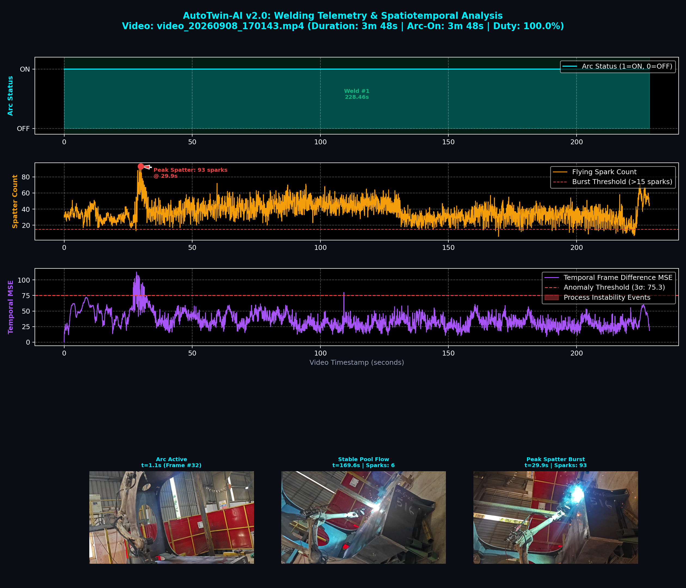
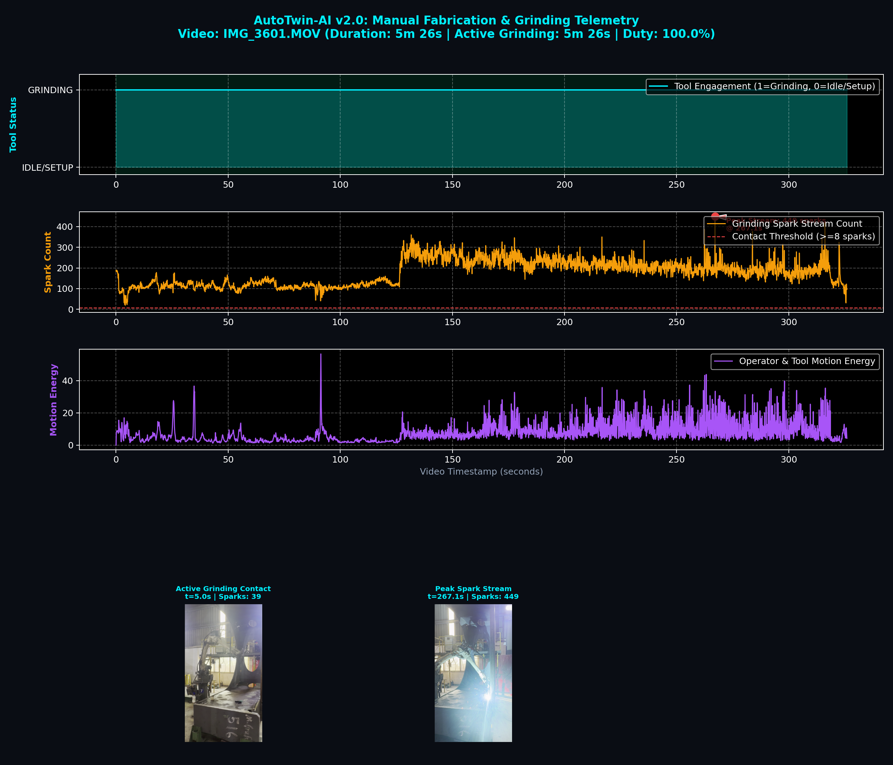
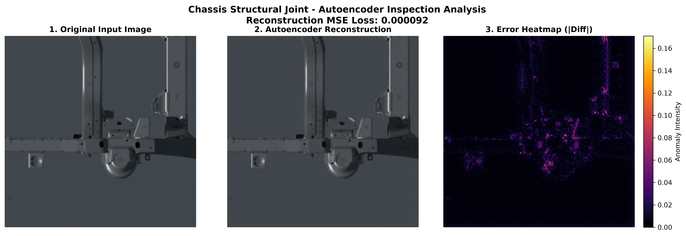
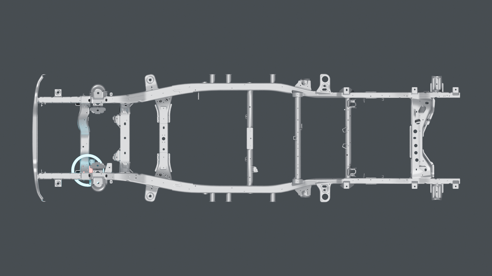
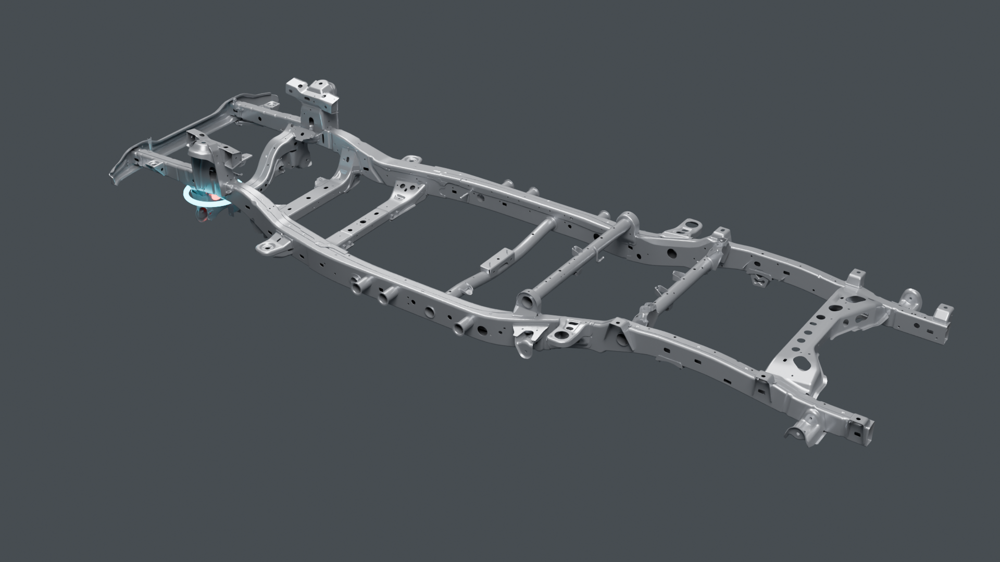
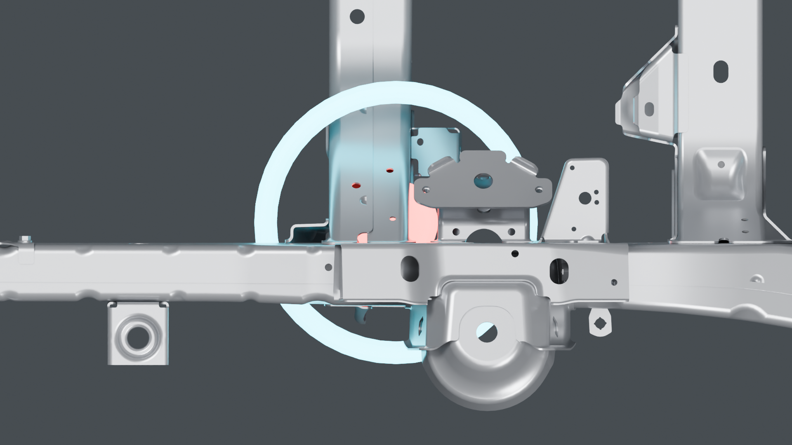
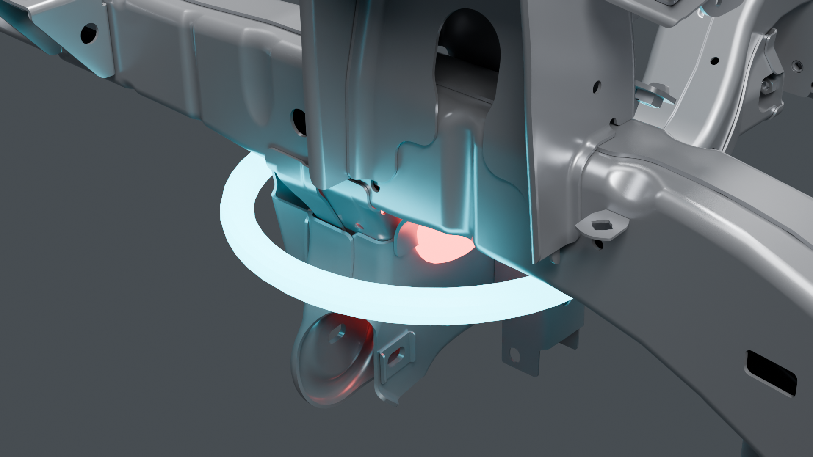
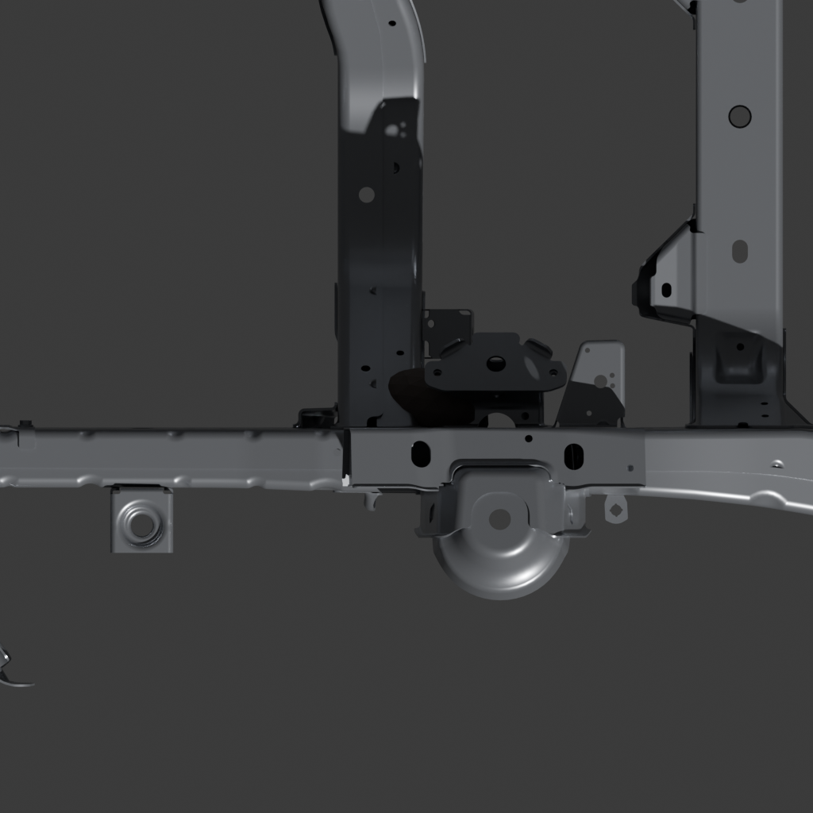
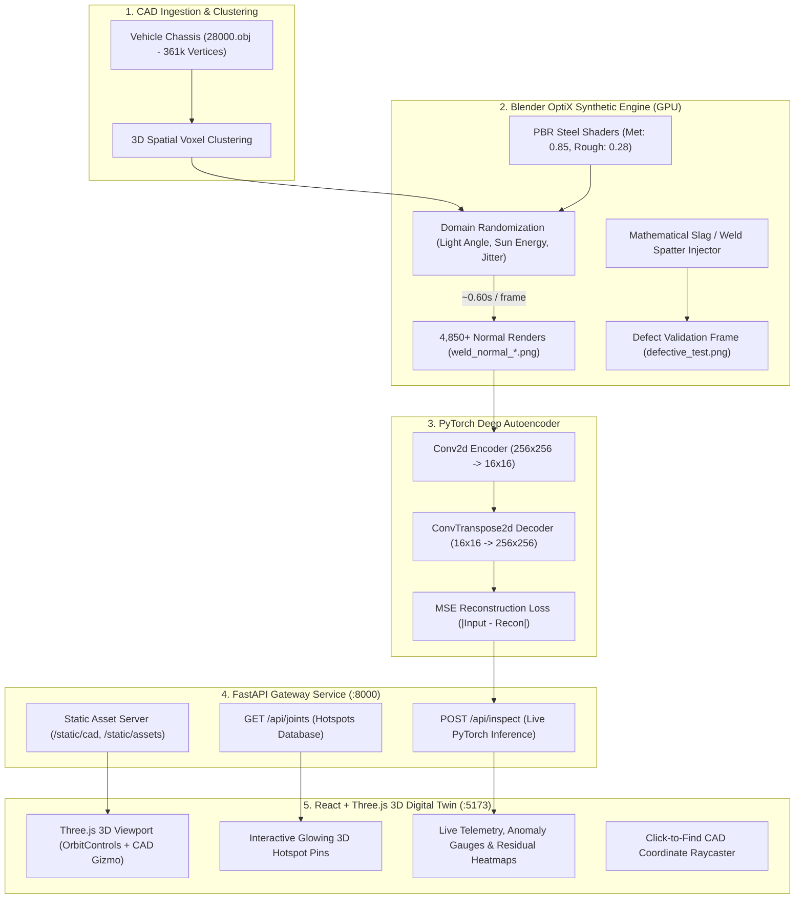

# 🏭 AutoTwin-AI: Industrial Digital Twin, Video Telemetry & Structural Inspection Platform

[](https://github.com/Arkz-Deepak/AutoTwin-AI/actions)
[-cyan.svg)](https://github.com/Arkz-Deepak/AutoTwin-AI/releases/tag/v2.0)
[-blue.svg)](https://github.com/Arkz-Deepak/AutoTwin-AI/releases/tag/v1.0)
[](https://www.python.org/)
[](https://pytorch.org/)
[](https://fastapi.tiangolo.com/)
[](https://docs.pmnd.rs/react-three-fiber)
[](https://tailwindcss.com/)
[](https://opensource.org/licenses/MIT)

An end-to-end **Industrial Digital Twin, Video Telemetry & Structural Inspection Platform** for vehicle ladder-frame chassis assemblies and heavy crane fabrication (Girder 516).

- **v2.0 (Current)**: Factory Video Telemetry POC — Automated Arc-On Time, Spatter Particle Tracking, Process Stability Indices, Manual Fabrication Telemetry, and Crane Gallery 28-Stage Takt Benchmarks.
- **v1.0**: Full-Stack 3D Ladder-Frame Chassis Digital Twin, 361k CAD vertex clustering, and Convolutional Autoencoder for microscopic defect detection.
- **v3.0 (Roadmap)**: Spatiotemporal ConvLSTM 5D Tensor Model for Next-Frame Prediction (branch [`feature/v3-convlstm`](https://github.com/Arkz-Deepak/AutoTwin-AI/tree/feature/v3-convlstm)).

---

## 🎬 v2.0: Factory Video Telemetry & Inspection POC

AutoTwin-AI v2.0 integrates real-world factory video telemetry to benchmark robotic welding against internal controller logs, monitor human manual fabrication, and enforce takt compliance across the **Crane Gallery Assembly**.

### 1. Robotic Welding Benchmarks (Girder 516 Seams)
The robotic welding videos serve as a controlled benchmark. Vision-derived metrics are compared against the robot's internal controller logs to validate measurement accuracy:

| Metric | Girder 516 // Inner Corner Seam (`170143`) | Girder 516 // Lower Flange Seam (`171604`) |
|:---|:---:|:---:|
| **Video Duration** | 228.52s (3m 48s) | 268.03s (4m 28s) |
| **Total Frames** | 6,860 @ 30.02 FPS | 8,046 @ 30.02 FPS |
| **Arc-On Duration** | **228.46s (100.0% Duty Cycle)** | **267.97s (100.0% Duty Cycle)** |
| **Spatter Tracking** | 36.87 sparks/frame (~1,106.9 sparks/s) | 86.95 sparks/frame (~2,610.2 sparks/s) |
| **Peak Spatter Burst** | **93 sparks** (@ $t = 29.91$s) | **297 sparks** (@ $t = 257.71$s) |
| **Process Stability Index** | **95.04%** (34 frames $> 3\sigma$) | **93.29%** (54 frames $> 3\sigma$) |
| **Controller Log Audit** | **READY FOR LOG VERIFICATION** | **READY FOR LOG VERIFICATION** |



---

### 2. Manual Fabrication & Grinding Telemetry (`IMG_3601.MOV`)
The ultimate deployment target is human fabrication workstations. Telemetry tracks manual tool engagement and correlates against standard fabrication cycle times:
- **Duration**: 326.01s (5m 26s) | 9,775 frames.
- **Active Grinding Contact Time**: **326.08s (100.0% Active Tool Engagement)**.
- **Peak Spark Stream**: **449 sparks/frame**, mean motion energy **7.53**.
- **Crane Gallery Benchmark Correlation** (`crane_gallery_stages.xlsx`):
  - Stage #5 (*I Beam UT & Cleaning*): 200 min cycle vs 227 min takt (**PASS**).
  - Stage #9 (*UT inspection & Cleaning*): 120 min cycle vs 227 min takt (**PASS**).
  - Stage #19 (*Assy cleaning & FW*): 160 min cycle vs 227 min takt (**PASS**).



---

## 📸 v1.0: 3D Chassis Digital Twin & Spatial Inspection

### 1. AI Structural Joint Anomaly Detection & Reconstruction Heatmap
The trained **PyTorch Convolutional Autoencoder** reconstructs baseline nominal joints and flags physical anomalies via high-intensity residual error heatmaps ($|I - \hat{I}|$):



---

### 2. True Structural CAD Joint Mapping
High-density 3D spatial voxel clustering isolates structural load-bearing junctions from **361,174 CAD vertices** (`28000.obj`):

| Top-Down Orthographic Chassis Overview | 3D Isometric CAD Perspective |
| :---: | :---: |
|  |  |

| Macro Top-Down Joint Crop (1:1 Sensor Framing) | High-Resolution Macro Perspective Detail |
| :---: | :---: |
|  |  |

---

### 3. Synthetic Defect Injection (Weld Slag & Spatter)
Mathematical defect generator spawning irregular, distorted oxidic slag geometry directly onto the suspension weld seam for out-of-distribution anomaly validation:



---

## 📌 System Architecture



---

## ⚡ Key Capabilities

- **3D WebGL Digital Twin Control Room (React + Three.js)**:
  - Full-scale **4.85-meter vehicle chassis** rendered with PBR metallic reflections and shadows.
  - Interactive **3D CAD Orientation Gizmo** with clickable axis alignment ($X, Y, Z$) and quick-view presets (**ISO, TOP, SIDE, FRONT**).
  - Built-in **Click-to-Find CAD Raycaster** that logs exact 3D surface coordinates when clicking the metal mesh.
  - Cyber-industrial dark UI with live telemetry, defect gauges, and scrollable heatmap inspection reports.
- **Blender Cycles OptiX GPU Acceleration**:
  - Accelerated via NVIDIA RTX GPU with hardware AI neural denoising.
  - Generates photorealistic `1024x1024` frames in **~0.60s – 0.80s** (~80x speedup over CPU).
  - In-memory persistent datablocks avoiding operator garbage collection bottlenecks.
- **Physics-Informed Domain Randomization**:
  - Multi-axis sun angle variance (Azimuth $0^\circ-360^\circ$, Pitch $25^\circ-70^\circ$, Roll $\pm 20^\circ$).
  - Dynamic factory lighting intensity shifts (`3.0` to `8.5` energy).
  - Sub-millimeter sensor mounting vibration and focal jitter ($\pm 0.03$ X/Y, $\pm 0.05$ Z, $\pm 3.5^\circ$ roll).
- **Deep Convolutional Autoencoder (CAE)**:
  - 4-stage convolutional downsampling with batch normalization and LeakyReLU activations.
  - Generates pixel-accurate reconstruction difference heatmaps ($|\text{Input} - \text{Reconstruction}|$) to pinpoint localized structural defects.

---

## 📊 Structural Joint Mapping Table

| Preset Key | Structural Joint Name | 3D CAD Coordinates $(X, Y, Z)$ | Local Vertices | Structural Details |
| :--- | :--- | :--- | :--- | :--- |
| `rear_sus_bracket` *(Defect Target)* | Rear Suspension Spring Perch | `[1.358, 0.220, 0.500]` | 18,395 | Rear spring perch tower and damper hardpoints (Slag defect test target). |
| `front_sus_bracket_left` | Front-Left Suspension Joint | `[-1.227, 0.140, 0.398]` | 29,947 | A-arm suspension mount, cross-tube weld interface, and frame rail flange. |
| `front_sus_bracket_right` | Front-Right Suspension Joint | `[-1.185, 0.140, -0.416]` | 26,822 | Symmetrical right A-arm bracket and gusset stiffener. |
| `engine_mount_crossmember` | Engine Mount Crossmember | `[-0.644, 0.100, -0.452]` | 21,557 | Heavy-duty chassis mounting bracket with reinforcement gussets. |

---

## 📂 Project Directory Structure

```
AutoTwin-AI/
├── .gitignore                                # Ignores large raw renders & CAD binaries
├── README.md                                 # Complete project documentation & visual gallery
├── requirements.txt                          # Python dependencies (PyTorch, FastAPI, Uvicorn, Trimesh)
│
├── backend/                                  # FastAPI Backend Service
│   └── main.py                               # API Gateway, CAD asset server & live PyTorch inference
│
├── frontend/                                 # React + Three.js 3D Web Application
│   ├── package.json                          # Node dependencies (@react-three/fiber, three, tailwindcss)
│   ├── vite.config.js                        # Vite dev server configuration
│   ├── tailwind.config.js                    # Cyber-industrial theme & palette
│   ├── postcss.config.js
│   ├── index.html                            # HTML entrypoint
│   └── src/
│       ├── App.jsx                           # Main dashboard, telemetry sidebar & heatmap modal
│       ├── DigitalTwinViewer.jsx             # Three.js 3D Canvas, CAD Gizmo & Hotspot Raycaster
│       ├── index.css                         # Custom cyberpunk glow styles & scanline animations
│       └── main.jsx                          # React DOM entrypoint
│
├── src/                                      # Core pipeline modules & algorithms
│   ├── __init__.py
│   ├── data_gen.py                           # Multi-joint synthetic dataset generator
│   ├── generate_autoencoder_dataset.py       # 5,000-sample domain-randomized baseline generator
│   ├── data_gen_anomalous.py                 # Synthetic structural defect & weld slag injector
│   ├── train_autoencoder_pytorch.py          # PyTorch Autoencoder training & heatmap visualizer
│   ├── data.py                               # Dataset verification & corrupted file cleaner
│   ├── generate_synthetic_data.py            # Multi-view reference renderer
│   └── debug_blender.py                      # Blender environment diagnostics
│
├── docs/                                     # Documentation assets & showcase images
│   └── assets/
│       ├── 01_full_top_view_true_joint.png
│       ├── 02_full_isometric_true_joint.png
│       ├── 03_zoomed_true_joint_top_crop.png
│       ├── 04_zoomed_true_joint_isometric_detail.png
│       ├── defective_test.png
│       └── reconstruction_analysis.png
│
├── cad_model/                                # Raw CAD assets (361k vertex chassis)
│   └── 28000.obj
│
├── joint_inspection/                         # Structural joint inspection metadata
│   └── joint_info.json                       # 3D spatial coordinates & cluster properties
│
├── models/                                   # Trained neural network artifacts
│   ├── autoencoder_best.pth                  # Best model checkpoint (PyTorch weights - 9.38 MB)
│   └── reconstruction_analysis.png
│
└── synthetic_dataset/
    ├── autoencoder_baseline/                 # 4,855 domain-randomized normal baseline frames
    │   └── manifest.json                     # Ground-truth camera/lighting metadata
    └── defective_test.png                    # Injected anomaly validation frame
```

---

## 🚀 Quickstart Guide

### 1. Environment Setup

```bash
# Clone the repository
git clone https://github.com/Arkz-Deepak/AutoTwin-AI.git
cd AutoTwin-AI

# Install Python dependencies (PyTorch with CUDA support)
pip install -r requirements.txt

# Install Frontend dependencies
cd frontend
npm install
cd ..
```

---

### 2. Run the Full-Stack Digital Twin Web Application

#### Start the FastAPI Backend (Port 8000):
```bash
cd backend
python -m uvicorn main:app --host 0.0.0.0 --port 8000 --reload
```
*(Interactive Swagger API docs available at `http://localhost:8000/docs`)*

#### Start the React + Three.js Frontend (Port 5173):
```bash
cd frontend
npm run dev
```
*(Open `http://localhost:5173` in your browser)*

---

### 3. Generate Synthetic Datasets (Blender OptiX Engine)

#### Generate 5,000 Baseline Images:
```powershell
# Windows
$env:NUM_IMAGES="5000"
& "C:\Program Files\Blender Foundation\Blender 5.1\blender.exe" -b --python src/generate_autoencoder_dataset.py
```

```bash
# Ubuntu Linux
NUM_IMAGES=5000 blender -b --python src/generate_autoencoder_dataset.py
```

#### Inject a Physical Structural Defect (Weld Slag):
```powershell
& "C:\Program Files\Blender Foundation\Blender 5.1\blender.exe" -b --python src/data_gen_anomalous.py
```

---

### 4. Train the Autoencoder & Generate Inspection Heatmaps

```bash
# Trains on GPU, evaluates reconstruction, and outputs 3-panel error heatmap
python src/train_autoencoder_pytorch.py
```

The script automatically generates [`models/reconstruction_analysis.png`](models/reconstruction_analysis.png) plotting:
1. **Original Frame**: Input PBR industrial joint.
2. **Autoencoder Reconstruction**: Learned clean topology.
3. **Anomaly Heatmap**: Absolute pixel reconstruction residual ($|I - \hat{I}|$).

---

## 🛡️ License

This project is licensed under the [MIT License](LICENSE).
